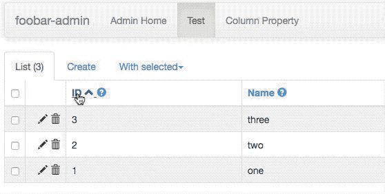

# Dynamically generate Flask-Admin column labels/descriptions

This demo app shows how to dynamically add column descriptions and
properly-capitalized labels from the column `COMMENT`s in a MySQL
database.

The `flask_admin.contrib.sqla.ModelView`'s `column_labels` and
`column_descriptions` properties are updated inside the `__init__` for
the `TestView` class (see [`views.py#L9`](views.py#L9)).

There is also a slight template tweak which adds question mark icons
into the list view column headers, which reveal the column comments upon
mouseover (overrides the `list_header` block from Flask-Admin's
`templates/bootstrap3/admin/model/list.html`).



Because SQLite [doesn't seem to support][1] column `COMMENT`s in SQL,
this demo requires a running MySQL server. Copy `sample_config.ini` to
`config.ini` and adjust the values inside to match your setup before
proceeding.

## Installation

```bash
git clone https://github.com/ernstki/flask-admin-column-labels 
cd flask-admin-column-labels

# (optional, create a virtual environment)
virtualenv venv && source venv/bin/activate

# fetch dependencies; add '--user' if not using a virtualenv
pip install -r requirements.txt

# launch app w/ optional port number (default: 5000)
python run.py  # 8080
```

## Additional configuration

The `CREATE TABLE` statement for the test database `foobar` used in the
included `app.py` looks like this:

```sql
CREATE TABLE `test` (
    `id` int(11) unsigned NOT NULL AUTO_INCREMENT COMMENT 'The unique ID for the record',
    `name` varchar(45) DEFAULT NULL COMMENT 'The name',
    `description` varchar(200) DEFAULT NULL COMMENT 'A longer description',
    PRIMARY KEY (`id`)
);
```

The `TableComment` model assumes a view is present on the server called
`v_table_comments`. This seemed easier to me than using two SQLAlchemy engines
or some weird table factory in order to query across two separate databases
(schemata) with the SQLAlchemy ORM.

The `CREATE VIEW` statement looks like this:

```sql
CREATE VIEW `v_table_comments` AS
    SELECT 
        `information_schema`.`TABLES`.`TABLE_NAME` AS `table_name`,
        `information_schema`.`TABLES`.`TABLE_COMMENT` AS `comment`
    FROM
        `information_schema`.`TABLES`
    WHERE
        (`information_schema`.`TABLES`.`TABLE_SCHEMA` = DATABASE());
```

If you define this view this as the `root` user, it will have `SQL SECURITY
DEFINER`, so all users will be able to access the contents of this view (all
metadata for the tables in `DATABASE()`); think about the security
implications of this if you are testing on a "real" MySQL server.

Both of the above statements are included in the included `setup.sql` script,
which you can source from within the `mysql` client once you've authenticated
with the server and done the appropriate `USE <database>`

## Additional goodies

The `ColumnProperty` model has a property called `proper_name` that will try
to properly title-case lower-case table names (joined by underscores), and
allows you to override the auto-capitalization by including something like

```
Proper name: ENCODE ID
```

anywhere in the column's comment. You can specify an arbitrary list of words
that should always be in ALL CAPS at the top of
[`models.py`](models.py).

[1]: https://www.sqlite.org/lang.html
